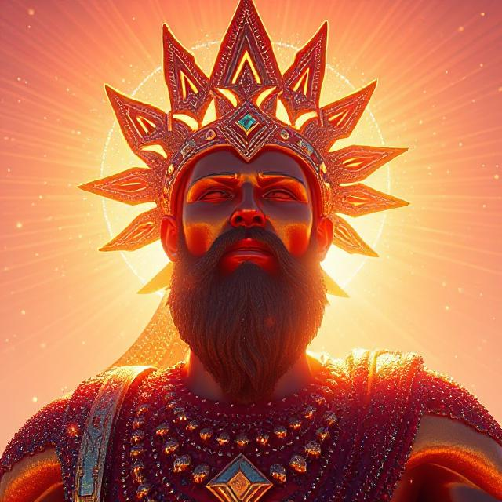

- O deus guardião do sol;
- Representa o dia, a luz, a verdade;
- Concebeu os campeões que governaram o império de Galadon desde do início até os dias atuais;
- É adorado por toda extensão do império principalmente por:
  - Humanos;
  - Pequeninos;