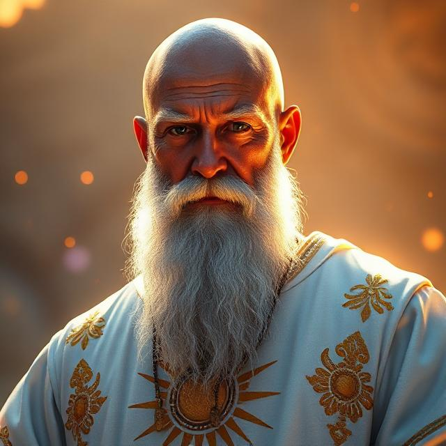
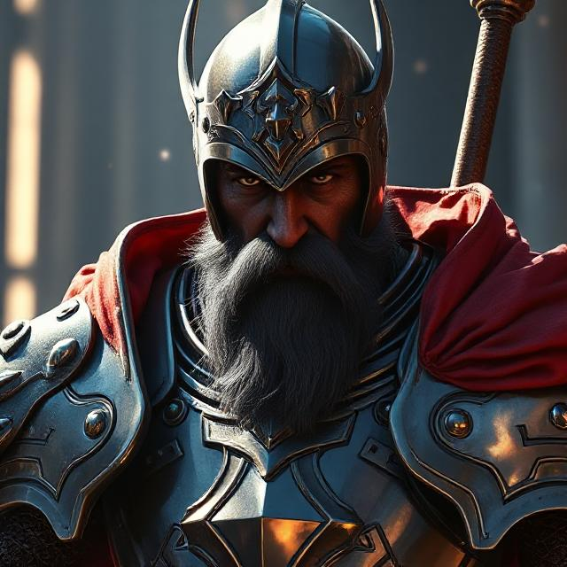

Com o domínio de toda região sul de Paræternün, o Império de Galadon é conhecido pela sua riqueza e imponência.
É também o maior fornecedor de alimentos abastecendo todos os reinos.

## Capital
---

A capital Galadon fica na região central logo abaixo do Grande Lago e é a maior cidade em população que se tem conhecimento.

Sua população é na maioria de humanos, mas após a grande migração, muitas outras raças habitam a cidade;

## Outras Regiões
---
### Vila Miúda 
Vilarejo rural de pequeninos à oeste da capital, rodeada por fazendas e plantações, principal responsável pela agropecuária do Império.

### Posto Escavado
Ao sul da capital, aos pés das Colinas do Sul, o Posto Escavado é um vilarejo focado em mineração habitado em sua maioria por anões.

### Floresta Solar
Principal floresta do Império à oeste da capital, ambiente sagrado para os seguidores de Gala.
Todos os anos são feitas peregrinações da capital até o Pico do Sol, pois acredita-se que o próprio deus do sol habita o topo da montanha.

### Passadouro
Região de acampamento dos exércitos de Galadon durante a Grande Guerra, agora uma pequena vila que serve de abrigo a viajantes que passam pela região, se sustentando apenas do comércio local.

### Recanto do Oculto
Uma área misteriosa com relatos de eventos sobrenaturais, a maioria da população do Império não ousa se aproximar desse local e por isso foi cedido à Wikadia para estudos.

### Zadash
Uma cidade que serve de refúgio para os excluídos dos outros reinos, em teoria está sobre o controle do Império de Galadon, mas que na prática não se submete a nenhum reino e não possui nenhum governante definido.

Palco de diversas batalhas entre o Galadon e Orland durante a Grande Guerra, hoje em dia o local é um barril de pólvora, sendo disputado por todos os reinos e guildas pela sua localização estratégica e comercial.

## Linguagem e Religião
---
A maioria da população do Império fala Comum, mas algumas regiões específicas falam Pequenino como na Vila Miúda e também Anão em Posto Escavado.

Não é permitido adorar a nenhum deus além de Gala ou æ no Império. Quem faz isso é perseguido e sofre consequências terríveis.

## Personalidades
---

### Imperador Aelius Alanor 

Imperador de Galadon e govenante de toda extensão do Império.

Considerado principal responsável pela Grande Guerra por incitar o primeiro confronto entre campeões e derrotar Olina Oybek de Orland.

Acredita-se que ele é o último campeão vivo do Deus Gala.

### Principe Adrian Alanor

Filho de Aelius Alanor e atualmente único herdeiro do Império de Galadon.

### Areg, o Ancião

Principal líder religioso de Galadon e conselheiro do Imperador.

### Raul, o Impiedoso

Comandante do exército de Galadon conhecido por sua crueldade e prazer em matar.
