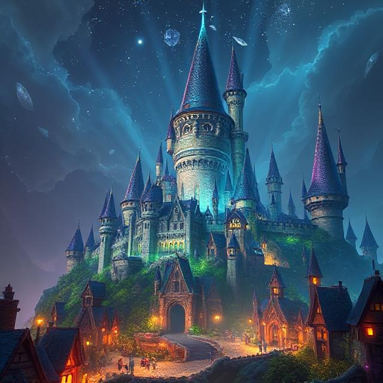

Wikadia fica ao norte de Paræternün, acima do Grande Lago, e é conhecida como a última cidade habitável da terra devido ao frio extremo das regiões mais ao norte.

Sendo uma Magocracia, toda sua estrutura política e social gira em torno do conhecimento arcano, são muito focados nos estudos e no que não se pode ver.

## Capital
---
A capital de Wikadia é uma cidade com todas as construções interligadas entre si, parecendo um grande castelo, onde não se vê mais a terra ao seus pés.

É o local mais cobiçado por magos em toda Paræternün, pois aqui podem estudar na Academia Arcanis e assim desenvolverem suas habilidades e conquistarem cargos maiores.

## Outras Regiões
---

### Bávia
A região da Bávia fica a noroeste de Wikadia e não se sabe muito o que tem por lá devido ao frio extremo.

Há uma centro de pesquisas na Academia Arcanis de Wikadia dedicado a explorar a região da Bávia e para isso utilizam magias para se aquecer e assim conseguir viajar para o local.

Os estudos indicam que lá vive um ser morto-vivo chamado Conde Cornelius em um castelo mal assombrado e que criaturas infernais protegem o local.

## Linguagem e Religião
---
A língua falada em Wikadia é Comum, pois atrai pessoas de todas as regiões de Paræternün para estudar magia.

Não há templos de adoração a deuses em Wikadia, porque a melhor forma de adorar ao deus Wik é através de estudos do sobrenatural, para isso foi criada a Academia Arcanis.

## Personalidades
---

### Diretor Melf 

O Diretor Melf é o atual governante de Wikadia e principal referência em arcanismo de Paræternün. Acredita-se que ele é um campeão do deus Wik.